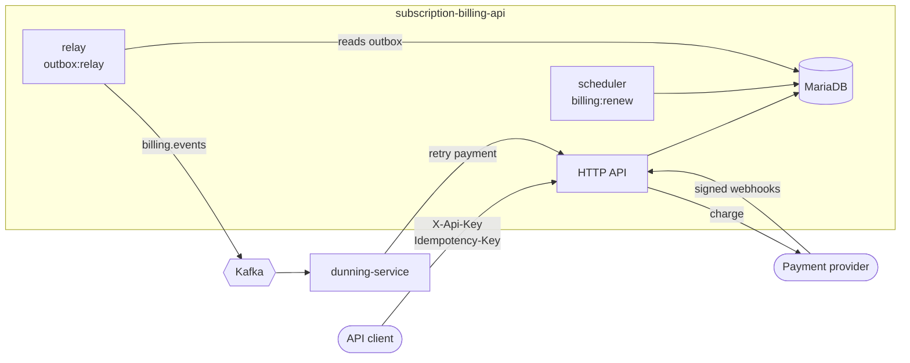

# Subscription Billing API

[](https://github.com/alaa-almouradi1/subscription-billing-api/actions/workflows/ci.yml)
[](https://github.com/alaa-almouradi1/subscription-billing-api/actions/workflows/e2e.yml)

A subscription billing and payments backend built with **Laravel 13 / PHP 8.3**,
**MariaDB**, and **Kafka**. It handles the parts of billing that are easy to get
subtly wrong: renewals that never double-bill, proration, payments that
survive retries and provider timeouts, and events that are never lost.

Companion service: [**dunning-service**](https://github.com/alaa-almouradi1/dunning-service)
(Python) consumes this API's events and retries failed payments.

## Features

| Area | What it does | Where to look |
|---|---|---|
| Plans and subscriptions | Monthly/yearly plans, free trials, cancel now or at period end | `SubscriptionService`, `SubscriptionStatus` |
| Renewals | `billing:renew` invoices each period exactly once; catches up after downtime | `RenewalService`, [ADR 2](docs/adr/0002-anchored-billing-periods.md) |
| Invoices | Gapless numbering (`INV-2026-000001`), void, write-off | `InvoiceIssuer`, `InvoiceNumberGenerator` |
| Proration | Upgrades charge the difference now; downgrades become account credit | `ProrationCalculator`, `PlanChangeService` |
| Payments | No double charges, timeouts are "unknown", not "failed" | `PaymentService`, [ADR 3](docs/adr/0003-payment-flow.md) |
| Idempotency | `Idempotency-Key` header replays the first response for retries | `EnsureIdempotency` |
| Webhooks | HMAC-signed, replay-protected, deduplicated provider webhooks | `PspWebhookController`, `WebhookSignature` |
| Events | Transactional outbox relayed to Kafka, ordered per subscription | `Outbox`, `OutboxRelay`, [ADR 4](docs/adr/0004-transactional-outbox.md) |
| Operations | Request IDs, JSON logs, readiness with outbox lag, Prometheus metrics | `OperationsController` |

## Architecture



State changes and the events that describe them are committed in **one**
transaction (`outbox_messages`). A separate relay process publishes them to
Kafka, so a crash can delay an event but never lose one or publish one for a
change that was rolled back.

Code is organised in layers:

```
app/
├── Domain/          Framework-free rules: Money, BillingCalendar, ProrationCalculator,
│                    state machines, WebhookSignature, the PaymentGateway port
├── Services/        Use cases that coordinate transactions and locks
├── Outbox/          Event recording, relay, and publishers (Kafka, log, in-memory)
├── Infrastructure/  Adapters (FakePaymentGateway)
├── Http/            Controllers, form requests, resources, middleware
└── Console/         billing:renew, outbox:relay, psp:simulate-webhook
```

More detail: [ER diagram](docs/erd.md) · [Event contract](docs/events.md) · [Decision records](docs/adr)

## Running it

### Option A: Docker Compose (API + MariaDB + Kafka + workers)

```bash
cp .env.example .env && php artisan key:generate   # compose reads APP_KEY from .env
docker compose up --build
bash scripts/smoke-test.sh                         # optional end-to-end check
```

The API listens on <http://localhost:8080>. Kafka is reachable from the host
at `localhost:29092`.

### Option B: plain PHP with SQLite (no Kafka)

```bash
composer install
cp .env.example .env && php artisan key:generate
touch database/database.sqlite && php artisan migrate
php artisan serve                     # http://localhost:8000
php artisan outbox:relay              # in a second terminal; events go to the log
```

## Tour of the API

All `/api/v1` requests need `X-Api-Key: local-dev-key`.

```bash
API=http://localhost:8080/api/v1
H=(-H "X-Api-Key: local-dev-key" -H "Content-Type: application/json" -H "Accept: application/json")

# A customer whose card will be declined, and a plan
CUSTOMER=$(curl -s "${H[@]}" $API/customers -d '{"name":"Ada","email":"ada@example.com","payment_method":"tok_chargeDeclined"}' | jq -r .data.id)
PLAN=$(curl -s "${H[@]}" $API/plans -d '{"code":"pro","name":"Pro","amount":4900,"currency":"EUR","interval":"month"}' | jq -r .data.id)

# Subscribing charges the first invoice immediately -> declined -> past_due
curl -s "${H[@]}" $API/subscriptions -d "{\"customer_id\":\"$CUSTOMER\",\"plan_id\":\"$PLAN\"}" | jq '.data | {status, invoice: .latest_invoice.status}'

# The customer adds a working card; retry the invoice (safe to repeat with the same key)
INVOICE=$(curl -s "${H[@]}" "$API/customers/$CUSTOMER/invoices" | jq -r '.data[0].id')
curl -s "${H[@]}" -X PATCH $API/customers/$CUSTOMER -d '{"payment_method":"tok_visa"}' > /dev/null
curl -s "${H[@]}" -H "Idempotency-Key: retry-1" $API/invoices/$INVOICE/pay | jq '.data.status'
```

Test cards for the fake provider: `tok_visa` (succeeds), `tok_chargeDeclined`,
`tok_insufficientFunds`, `tok_pending` (settled later by webhook:
`php artisan psp:simulate-webhook <payment-id> succeeded`), and `tok_timeout`
(outcome unknown).

## Tests

```bash
php artisan test          # unit + feature tests on in-memory SQLite
vendor/bin/pint --test    # code style
```

CI runs the suite on **SQLite and MariaDB**, and a separate workflow boots the
whole Docker Compose stack and checks that events actually reach Kafka.

Some tests worth reading:

- `RenewalTest`: no double billing, catch-up after downtime, 31 January anchors
- `PaymentTest` / `IdempotencyTest`: declines, timeouts, retries, replayed responses
- `PspWebhookTest`: forged signatures, duplicate deliveries, out-of-order outcomes
- `OutboxEventsTest` / `OutboxRelayTest`: events roll back with their transaction; broker outages preserve order

## What I would build next

- A real provider adapter (Adyen or Stripe) behind `PaymentGateway`, plus a
  reconciliation job for payments stuck in `processing`
- Refunds and credit notes
- VAT/tax calculation per customer country
- An OpenAPI specification generated from the form requests and resources
- Debezium-based CDC instead of the polling relay (see ADR 4)
