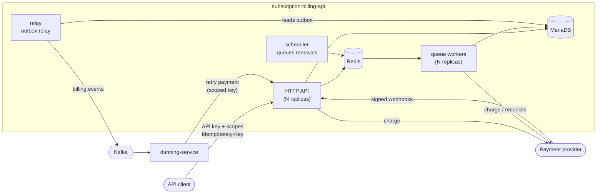

# Subscription Billing API

[](https://github.com/alaa-almouradi1/subscription-billing-api/actions/workflows/ci.yml)
[](https://github.com/alaa-almouradi1/subscription-billing-api/actions/workflows/e2e.yml)

A subscription billing and payments backend built with **Laravel 13 / PHP 8.3**,
**MariaDB**, **Redis** and **Kafka**. It handles the parts of billing that are easy
to get subtly wrong: renewals that never double-bill, proration, payments that
survive retries and provider timeouts, and events that are never lost. It is
built to run as a live service: least-privilege API keys, rate limits, queue
workers that scale horizontally, and bounded tables.

Companion service: [**dunning-service**](https://github.com/alaa-almouradi1/dunning-service)
(Python) consumes this API's events and retries failed payments.

## Features

| Area | What it does | Where to look |
|---|---|---|
| Plans and subscriptions | Monthly/yearly plans, free trials, cancel now or at period end | `SubscriptionService`, `SubscriptionStatus` |
| Renewals | Each period invoiced exactly once, by queued jobs on horizontally scaled workers; catches up after downtime | `RenewSubscription`, `RenewalService`, [ADR 2](docs/adr/0002-anchored-billing-periods.md), [ADR 6](docs/adr/0006-queued-renewals.md) |
| Invoices | Gapless numbering (`INV-2026-000001`), void, write-off, cursor-paginated lists | `InvoiceIssuer`, `InvoiceNumberGenerator` |
| Proration | Upgrades charge the difference now; downgrades become account credit | `ProrationCalculator`, `PlanChangeService` |
| Payments | No double charges; timeouts are "unknown", not "failed"; stuck payments reconciled with the provider | `PaymentService`, `ReconcilePayments`, [ADR 3](docs/adr/0003-payment-flow.md) |
| Idempotency | `Idempotency-Key` header replays the first response for retries | `EnsureIdempotency` |
| Webhooks | HMAC-signed, replay-protected, deduplicated, rate-limited provider webhooks | `PspWebhookController`, `WebhookSignature` |
| Events | Transactional outbox relayed to Kafka in batches, ordered per subscription | `Outbox`, `OutboxRelay`, [ADR 4](docs/adr/0004-transactional-outbox.md) |
| Security | Named API clients with hashed keys and scopes, per-client and per-invoice rate limits, security headers | `ApiClientRegistry`, `RequireScope`, [ADR 5](docs/adr/0005-api-clients-and-scopes.md) |
| Operations | Request IDs, JSON logs, readiness with outbox lag, protected Prometheus metrics, retention pruning | `OperationsController`, `routes/console.php` |

## Architecture



State changes and the events that describe them are committed in **one**
transaction (`outbox_messages`). A separate relay publishes them to Kafka, so
a crash can delay an event but never lose one or publish one for a change that
was rolled back.

Code is organised in layers:

```
app/
├── Domain/          Framework-free rules: Money, BillingCalendar, ProrationCalculator,
│                    state machines, WebhookSignature, the PaymentGateway port
├── Services/        Use cases that coordinate transactions and locks
├── Jobs/            Queued work (RenewSubscription)
├── Outbox/          Event recording, relay, and publishers (Kafka, log, in-memory)
├── Auth/            API clients, hashed keys, scopes
├── Infrastructure/  Adapters (FakePaymentGateway)
├── Http/            Controllers, form requests, resources, middleware
└── Console/         billing:renew, payments:reconcile, outbox:relay, billing:client
```

More detail: [ER diagram](docs/erd.md) · [Event contract](docs/events.md) · [Decision records](docs/adr)

## Security

| Concern | How it is handled |
|---|---|
| Authentication | Each calling service is a named client. Only the **SHA-256 hash** of its key is configured (`BILLING_API_CLIENTS`), so a leaked config holds no usable credentials. Keys come from `php artisan billing:client` (256 random bits). Sent as `X-Api-Key` or `Authorization: Bearer`. |
| Authorization | Least-privilege scopes per route (`billing.read`, `payments.write`, `ops.read`, ...). The dunning service can retry payments and cancel subscriptions, but not create plans or customers. |
| Key rotation | Two entries with the same name are valid at once: add the new key, deploy it to the client, remove the old one. |
| Abuse | Rate limits per client, per invoice for payment attempts (bounds retry storms and card testing), and per IP for webhooks; counters in Redis, shared by all instances. |
| Webhooks | HMAC-SHA256 over timestamp and raw body, 5-minute replay window, constant-time comparison, secret rotation. |
| Card data | Never stored or seen: only provider tokens, which are never returned by the API. |
| Transport and headers | `nosniff`, `X-Frame-Options: DENY`, `Cache-Control: no-store` on API responses, HSTS behind TLS; `TRUSTED_PROXIES` so rate limits and logs see real client IPs. |
| Exposure | `/api/metrics` needs the `ops.read` scope; readiness exposes status only. Production image: `APP_DEBUG=false`, `expose_php=Off`, server tokens hidden, 1 MB request-body limit. |
| Supply chain | `composer audit` in CI; Dependabot for Composer, GitHub Actions and Docker. |

## Scaling and performance

| Concern | How it is handled |
|---|---|
| Stateless API | Any number of replicas behind a load balancer. The API keeps no session state; rate-limit counters, scheduler locks and queues live in Redis. |
| Renewals | The scheduler only scans for due subscriptions (keyset pagination over an index) and queues one unique job per subscription. Queue workers charge cards in parallel, so a slow payment provider never holds up the rest; add workers to go faster. |
| Contention | Row locks are held only around database work, never around provider calls. Transactions retry automatically on deadlocks and lock-wait timeouts. |
| Event throughput | The relay publishes up to 500 events per round trip (compressed, idempotent producer) and marks them with a single UPDATE. |
| Bounded tables | Expired idempotency keys, old webhook events and published outbox rows are pruned daily, in chunks. |
| Hot queries | Indexes for every polling query (due renewals, unpublished events, stuck payments); invoice lists use cursor pagination instead of OFFSET; metric aggregates are cached for 60 s. |
| Runtime | OPcache without timestamp checks, cached config/routes/events at container start, optimized autoloader. |

**Known limits.** Invoice numbering is a per-year counter row, a deliberate
serialization point required for gapless numbers. The relay runs as a single
instance to guarantee ordering (partitioning it by key hash is the next step).
Throughput has not been load-tested yet.

## Running it

### Option A: Docker Compose (API, workers, MariaDB, Redis, Kafka)

```bash
cp .env.example .env && php artisan key:generate   # compose reads APP_KEY from .env
docker compose up --build                          # add --scale worker=4 for more workers
bash scripts/smoke-test.sh                         # optional end-to-end check
```

The API listens on <http://localhost:8080>; Kafka is reachable from the host at
`localhost:29092`. Demo keys: `local-dev-key` (all scopes),
`dunning-local-key` (the dunning service's scopes) and `prometheus-local-key`
(`ops.read`).

### Option B: plain PHP with SQLite (no Kafka, no Redis)

```bash
composer install
cp .env.example .env && php artisan key:generate
touch database/database.sqlite && php artisan migrate
php artisan serve                                  # http://localhost:8000
php artisan queue:work --queue=billing,default     # second terminal: renewals
php artisan outbox:relay                           # third terminal: events go to the log
```

## Tour of the API

All `/api/v1` requests need an API key; `local-dev-key` has every scope.

```bash
API=http://localhost:8080/api/v1
H=(-H "X-Api-Key: local-dev-key" -H "Content-Type: application/json" -H "Accept: application/json")

# A customer whose card will be declined, and a plan
CUSTOMER=$(curl -s "${H[@]}" $API/customers -d '{"name":"Ada","email":"ada@example.com","payment_method":"tok_chargeDeclined"}' | jq -r .data.id)
PLAN=$(curl -s "${H[@]}" $API/plans -d '{"code":"pro","name":"Pro","amount":4900,"currency":"EUR","interval":"month"}' | jq -r .data.id)

# Subscribing charges the first invoice immediately -> declined -> past_due
curl -s "${H[@]}" $API/subscriptions -d "{\"customer_id\":\"$CUSTOMER\",\"plan_id\":\"$PLAN\"}" | jq '.data | {status, invoice: .latest_invoice.status}'

# The customer adds a working card; retry the invoice (safe to repeat with the same key)
INVOICE=$(curl -s "${H[@]}" "$API/customers/$CUSTOMER/invoices" | jq -r '.data[0].id')
curl -s "${H[@]}" -X PATCH $API/customers/$CUSTOMER -d '{"payment_method":"tok_visa"}' > /dev/null
curl -s "${H[@]}" -H "Idempotency-Key: retry-1" $API/invoices/$INVOICE/pay | jq '.data.status'

# Create a key for a new service, with only the scopes it needs
php artisan billing:client reporting-service --scope=billing.read
```

Test cards for the fake provider: `tok_visa` (succeeds), `tok_chargeDeclined`,
`tok_insufficientFunds`, `tok_pending` (settled later by webhook:
`php artisan psp:simulate-webhook <payment-id> succeeded`), and `tok_timeout`
(outcome unknown; settled by `payments:reconcile`).

## Tests

```bash
php artisan test          # 128 unit and feature tests on in-memory SQLite
vendor/bin/pint --test    # code style
composer audit            # known vulnerabilities in dependencies
```

CI runs the suite on **SQLite and MariaDB**, and a separate workflow boots the
whole Docker Compose stack and checks that events actually reach Kafka.

Some tests worth reading:

- `RenewalTest` / `RenewalQueueTest`: no double billing, catch-up after downtime, 31 January anchors, one queued job per due subscription
- `PaymentTest` / `IdempotencyTest` / `PaymentReconciliationTest`: declines, timeouts, retries, replayed responses, stuck payments
- `PspWebhookTest`: forged signatures, duplicate deliveries, out-of-order outcomes
- `ApiAuthenticationTest` / `RateLimitAndHeadersTest`: scopes, key rotation, rate limits
- `OutboxEventsTest` / `OutboxRelayTest`: events roll back with their transaction; broker outages preserve order

## What I would build next

- A real provider adapter (Adyen or Stripe) behind `PaymentGateway`
- Load tests (k6) for the renewal workers and the payment endpoint, with the results in this README
- Partitioned outbox relays (one per key-hash range) for higher event throughput
- OAuth2 client credentials with short-lived tokens instead of static API keys
- Refunds, credit notes and VAT per customer country
- An OpenAPI specification generated from the form requests and resources
