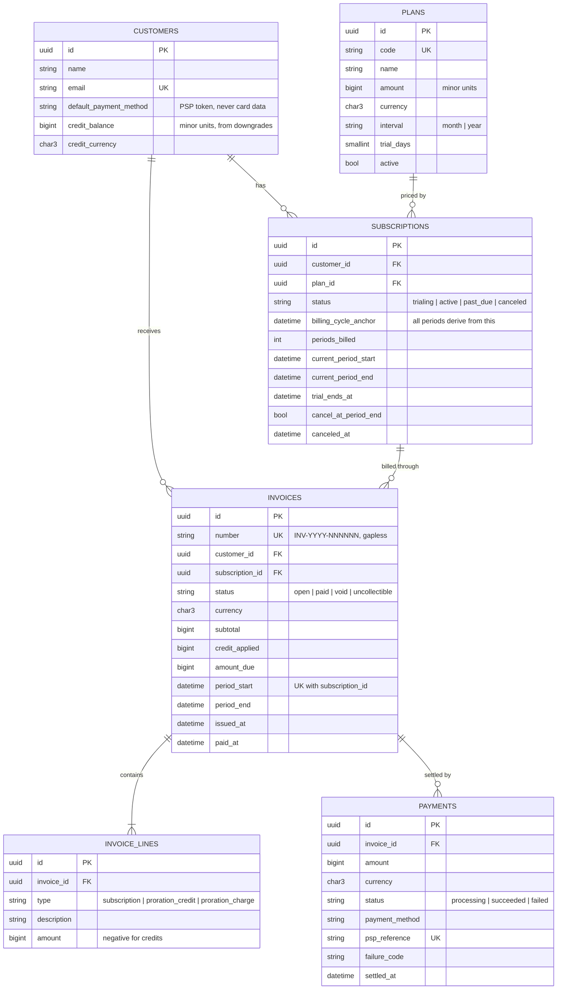

# Entity relationship diagram

## Supporting tables

These have no foreign keys into the domain; they exist for reliability.

| Table | Purpose | Key constraint | Retention |
|---|---|---|---|
| `invoice_sequences` | Gapless invoice numbers per year, incremented under a row lock | `prefix` primary key | forever (one row per year) |
| `idempotency_keys` | Stored responses for `Idempotency-Key` replays | unique `(scope, idempotency_key)` | 24 hours |
| `webhook_events` | Provider events already applied | provider event ID as primary key | 30 days |
| `outbox_messages` | Domain events waiting to be published to Kafka | auto-increment `id` gives publish order | 7 days after publishing |

Old rows are deleted in chunks by the daily `model:prune` command.

## Constraints that protect money

- `invoices (subscription_id, period_start)` is **unique**: even if two renewal
  workers race, a period can only be invoiced once.
- `payments.psp_reference` is **unique**: one provider charge maps to one payment.
- All amounts are **integers in minor units** (see [ADR 0001](adr/0001-money-as-integer-minor-units.md)).
- Business timestamps use `DATETIME`, not `TIMESTAMP`, which overflows in 2038.
